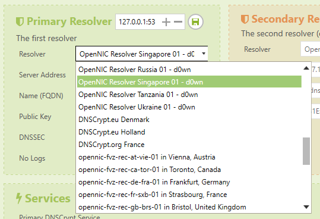
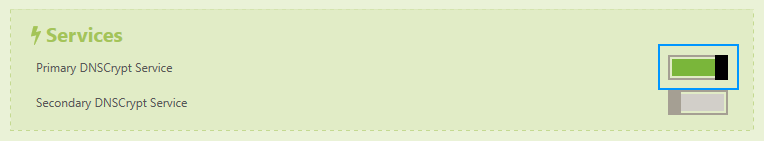

The following page is a quick guide to [DNSCrypt](https://dnscrypt.org/), a protocol designed to improve your DNS security.

English &#124; Bahasa Indonesia (coming soon!)

## Table of Contents

* [Introduction](#introduction)
* [What is DNSCrypt?](#what-is-dnscrypt)
* [Guide for Windows](#guide-for-windows)
* [Guide for macOS](#guide-for-macos)

---

## Introduction

There comes a time where you would use an alternate Domain Name System (DNS) server over the DNS servers provided by your internet service provider (ISP), be it to improve your Internet performance, get around filters, etc. How-To Geek has [a good article](http://www.howtogeek.com/167239/7-reasons-to-use-a-third-party-dns-service/) explaining why you would prefer to use an alternate DNS service. A few popular alternate DNS servers include [Google Public DNS](https://developers.google.com/speed/public-dns/), [Cisco OpenDNS](https://www.opendns.com/) or [OpenNIC](https://www.opennicproject.org/).

However, at some times, these alternate DNS servers might be intercepted by your ISP, allowing your ISP to be able to log your Internet activities again. This is called a **DNS leak**. A good way to test this is through the [DNS leak test](https://dnsleaktest.com/).

For instance, here's a test run by someone using the Google Public DNS, run on a different network from mine.

However, when running the same test using the same DNS provider through my own network, I see this.

As you can see, the default DNS server from my own ISP is now showing instead of the standard DNS servers provided by Google Public DNS. This is a simple case of a **DNS leak**.

---

## What is DNSCrypt?

### What it does

DNSCrypt solves the DNS leak problem mentioned above. It uses cryptographic signatures to verify that responses originate from the chosen DNS resolver and haven't been tampered with.

Your ISP often intercepts the DNS resolvers you use, and then swap them with their own DNS resolver. This can be used to do various things, whether it's to log their customers' activities, inject ads to your browser, or even block certain domains.

If you're worried about the things mentioned above, then this is the right tool for you.

### What it doesn't do

Please be aware that DNSCrypt is **not a VPN**, or a replacement for it. It does not anonymize your connection at all. DNSCrypt is just a protocol used to verify and authenticate your connection with your DNS resolver, as explained above.

If you're really concerned about your privacy and want to stay anonymous, consider [buying a VPN](https://www.privateinternetaccess.com/), or use [Tor](https://www.torproject.org/) instead.

---

## Guide for Windows

In this section, we'll cover some ways to install DNSCrypt into your Windows machine. The easiest way would be to install a GUI client that will help you set it up, or if you're a little more advanced, you can [skip forward](#the-hard-way-command-line) for a guide on setting it up on the command line.

### The easy way (GUI client)

If you don't know how to set up DNSCrypt through a command line, a few DNSCrypt clients are available for Windows:

* [Simple DNSCrypt](https://simplednscrypt.org/)
* [DNSCrypt WinClient](https://github.com/Noxwizard/dnscrypt-winclient)
* [DNSCrypt Windows Service Manager](http://simonclausen.dk/projects/dnscrypt-winservicemgr/)

This guide will use Simple DNSCrypt. If you would like to use other clients within the list, please read through the manual for the client you want to use.

Simple DNSCrypt provides an easy interface to manage your DNSCrypt services, the DNS resolvers you use as well as linking your computer's network adapters to the DNSCrypt service.

First, download the installer from [the Simple DNSCrypt website](https://simplednscrypt.org/), and install it. (**Note:** administrator rights might be required in order to install and run this app!)

Once the setup has been completed, and you run the app, you will see this.

The top part of this window is your network adapters. Active network adapters that aren't linked to the DNSCrypt service are marked grey, and when you link it to the DNSCrypt service, it will turn green. Inactive adapters are marked grey.

The middle part is where you configure your DNS resolvers. So far Simple DNSCrypt doesn't have support for secondary resolvers, but this will come in a later update. The bottom part of the window is an option to toggle your DNSCrypt services off.

To configure your DNSCrypt service, first you will have to choose which DNSCrypt resolvers you will use. I prefer OpenNIC.

Then, toggle this switch to activate your DNSCrypt service.

And lastly, click on a network adapter to activate the service for that adapter. Basically, what this does is replace your preferred DNS server to `127.0.0.1`, since that's where the DNSCrypt service runs on.

Run the DNS leak test again, and your DNS resolver should work normally again!

### The hard way (command line)

If you're an advanced user and you want more control of the DNSCrypt service, you can always set it up from the command line. [Dominus Temporis](https://dominustemporis.com/2014/05/dnscrypt-on-windows-update/) has a nice guide to get the DNSCrypt service running through the command line.

---

## Guide for macOS

Coming soon!

---

Hope this guide helps! Feel free to [tweet at me](https://twitter.com/resir014) if you need any help setting it up.
