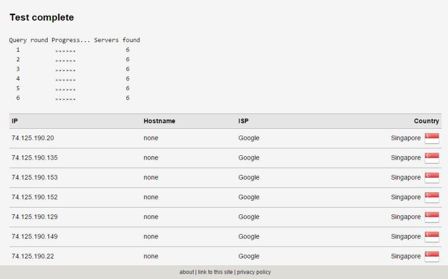
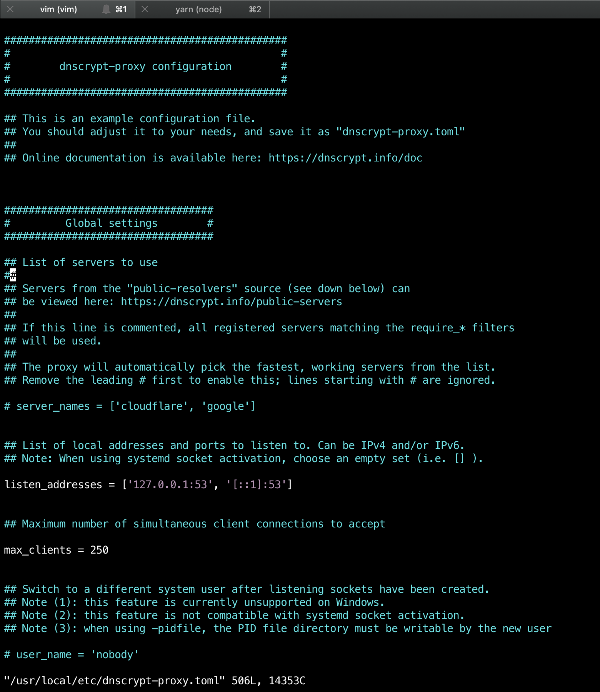
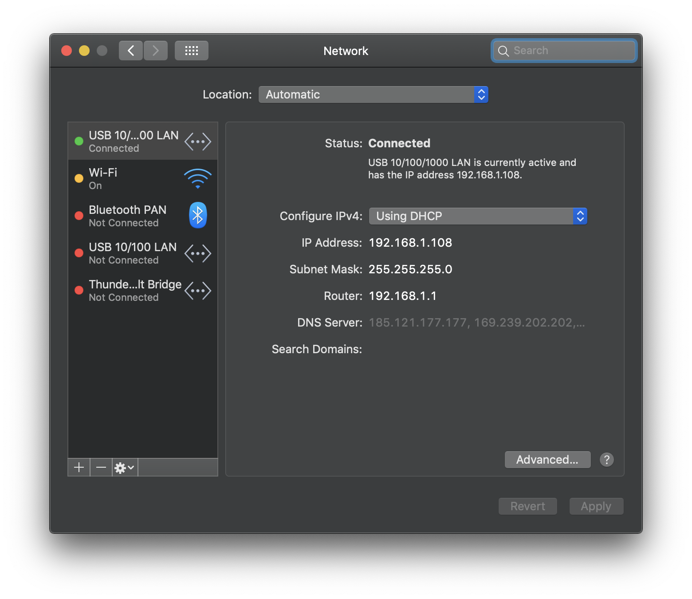

The following page is a quick guide to [DNSCrypt](https://dnscrypt.info/), a protocol designed to improve your DNS security.

English &#124; Bahasa Indonesia (coming soon!)

## Table of Contents

- [Introduction](#introduction)
- [What is DNSCrypt?](#what-is-dnscrypt)
- [Guide](#guide)
  - [Windows](#windows)
  - [macOS](#macos)

---

## Introduction

There comes a time where you would use an alternate Domain Name System (DNS) server over the DNS servers provided by your internet service provider (ISP), be it to improve your Internet performance, get around filters, etc. How-To Geek has [a good article](http://www.howtogeek.com/167239/7-reasons-to-use-a-third-party-dns-service/) explaining why you would prefer to use an alternate DNS service. A few popular alternate DNS servers include [Google Public DNS](https://developers.google.com/speed/public-dns/), [Cloudflare 1.1.1.1](https://1.1.1.1/) or [OpenNIC](https://www.opennicproject.org/).

However, at some times, these alternate DNS servers might be intercepted by your ISP, allowing your ISP to be able to log your Internet activities again. This is called a **DNS leak**. A good way to test this is through the [DNS leak test](https://dnsleaktest.com/).

For instance, here's a test run by someone using the Google Public DNS, run on a different network from mine.



However, when running the same test using the same DNS provider through my own network, I see this.


As you can see, the default DNS server from my own ISP is now showing instead of the standard DNS servers provided by Google Public DNS. This is a simple case of a **DNS leak**.

---

## What is DNSCrypt?

### What it does

DNSCrypt solves the DNS leak problem mentioned above. It uses cryptographic signatures to verify that responses originate from the chosen DNS resolver and haven't been tampered with.

Your ISP often intercepts the DNS resolvers you use, and then swap them with their own DNS resolver. This can be used to do various things, whether it's to log their customers' activities, inject ads to your browser, or even block certain domains.

If you're worried about the things mentioned above, then this is the right tool for you.

### What it doesn't do

Please be aware that DNSCrypt is **not a VPN**, or a replacement for it. It does not anonymize your connection at all. DNSCrypt is just a protocol used to verify and authenticate your connection with your DNS resolver, as explained above.

If you're really concerned about your privacy and want to stay anonymous, consider [buying a VPN](https://www.privateinternetaccess.com/), or use [Tor](https://www.torproject.org/) instead.

---

## Guide

The DNSCrypt team has release `dnscrypt-proxy` 2.0, which has a more streamlined setup compared to version 1.0. If you don't know how to set up DNSCrypt through a command line, setting it up is a lot easier now.

`dnscrypt-proxy` 2.0 is supported by other DNSCrypt clients for Windows listed [here](https://dnscrypt.info/implementations). If you would like to use other clients within the list, please read through the manual for the client you want to use.

### Windows

This guide will use [Simple DNSCrypt](https://simplednscrypt.org/). Simple DNSCrypt provides an easy interface to manage your DNSCrypt services, the DNS resolvers you use as well as linking your computer's network adapters to the DNSCrypt service.

First, download the installer from [the Simple DNSCrypt website](https://simplednscrypt.org/), and install it. (**Note:** administrator rights might be required in order to install and run this app!)

Once the setup has been completed, and you run the app, you will see this.


For the most part, you can ignore this section. However, on the "Service" section, activate the "DNSCrypt Service" toggle. This will turn on your DNSCrypt service. Then select the network adapters you'd like to route through the DNSCrypt service on the section below. It's that simple!

Next, go to the "Resolvers" tab.


By default, `dnscrypt-proxy` will automatically pick the fastest DNSCrypt resolver from the list in this section. If you want to pick a resolver manually, disable the "Automatic" toggle and select one or more DNSCrypt resolvers from the list below.

My recommended DNSCrypt resolvers from this list are:

- Cloudflare 1.1.1.1 (cloudflare)
- Google Public DNS (google)
- OpenNIC (opennic-onic)

Once everything is set up, run the DNS leak test again, and your DNS resolver should work normally again!

### macOS

The `dnscrypt-proxy` service is available for install via [Homebrew](https://brew.sh/) package manager. To install it, run:

```sh-session
$ brew install dnscrypt-proxy
```

Out of the box, it will find the fastest DNS resolver from the [public servers list](https://dnscrypt.info/public-servers), but you can change it. The config file is located in `/usr/local/etc/dnscrypt-proxy.toml`. Open it with your favourite text editor.



To change your preferred DNS resolver, uncomment the `server_names` line, and add your preferred names based on the [public servers list](https://dnscrypt.info/public-servers). So for example, if you want to include Google DNS, Cloudflare DNS, and OpenNIC, write down:

```toml
server_names = ['google', 'cloudflare', 'opennic-onic']
```

Save the config, and start the `dnscrypt-proxy` service. This will allow `dnscrypt-proxy` to automatically start next time you boot up your Macbook.

```sh-session
$ sudo brew services start dnscrypt-proxy
```

By default, the DNSCrypt proxy will run on `127.0.0.1.` Therefore, we will need to change our DNS server to that. Open `System Preferences > Network`, then select the device currently connected to the internet.



Then, we will need to change our DNS. Click on "Advanced" and go to the "DNS" tab. Then on the left column, click the plus icon to add a new DNS address. Type `127.0.0.1`, the address of our DNSCrypt proxy.


Press Enter to add it to the list, then press OK and Apply.

Congratulations, DNSCrypt is now configured on your Mac! Run the DNS leak test again, just to make sure it's configured correctly.

---

Hope this guide helps! Feel free to [tweet at me](https://twitter.com/resir014) if you need any help setting it up.
