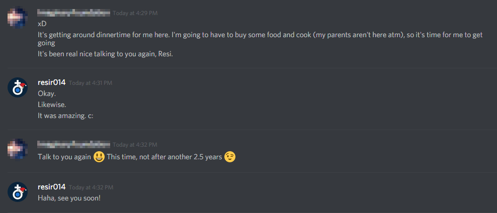

*Originally posted on [bold.io](https://bold.io/something-amazing-that-happened-2017-01-03) at 03 January 2017.*

---

So there was this old, online friend of mine. We met a long time ago on a game called [DarkOrbit](http://www.darkorbit.co.uk/). I was fairly new to the game when I met them, and they've known it for quite a while. So I stuck around with him, learning the ropes of the game with him, and I'd eventually got the hang of it, and we stuck together, doing whatever it was that we're doing back then in the game.

When my interest with the game diminished, we still talked together, firstly on MSN Messenger, then when MSN Messenger got discontinued, we continued talking through Hangouts (Google Talk back then), since we both have Gmail addresses. We got closer each day and we became best friends. We continued talking, until they had to move to another country, where their access to instant messaging was limited and we lost most of our means of contact, so email was our last resort. We continued exchanging emails until he eventually disappeared. Until recently.

On December 28th, I received a random message on Hangouts, out of the blue. I couldn't believe my eyes. It was him.

We were finally reunited after being separated for *two and a half years*.

I asked how were they able to find me again, they said they found me back because they noticed one of their email drafts that were supposed to be sent to me. We ended up talking a lot that day, because there were just so many things that we wanted to exchange during the whole separation.

At one point during that day, we even ended our conversation like this.

My heart ached.

You know how they say "good friends last a lifetime"? We still remembered each other after being separated for that long, and we've stuck to each other ever since we've met a long time ago. It doesn't matter if that friend exists in your physical realm, or exists merely in the forms of words on your screen, or even the voices of them being transmitted across this series of tubes that you hear, when they have been a really good friend of yours, both of you will remember each other for as long as life can tell.

And that's why I appreciate every single one of my friends, both in the meatspace, and in the online space.

If you can read this, thank you for being a part of my life.

Happy New Year.
