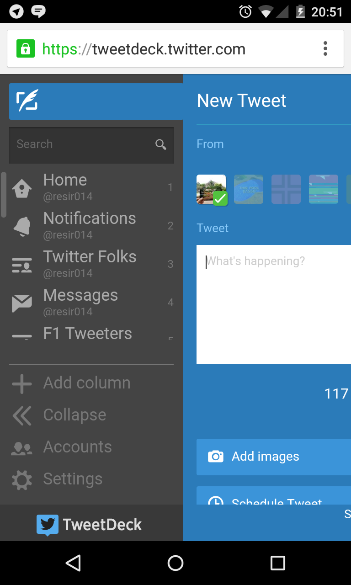

Most of us power [Twitter](https://twitter.com/) users already know about the usefulness of [TweetDeck](https://about.twitter.com/products/tweetdeck), especially how it helps you manage multiple accounts and timelines with ease. I use TweetDeck everyday to manage my handful amount of Twitter accounts.

I like it so much, that I kinda wished it would be brought into the mobile. We did see a mobile version of TweetDeck once, but unfortunately it was ditched after Twitter bought TweetDeck in favour of the official mobile app.

Though this doesn't mean you can no longer access TweetDeck from your phone. The current version on TweetDeck is actually a web app based on HTML5 so not only can it run natively on desktops, you can also run it on any supported browsers.

So if your phone has a working web browser, you should _technically_ be able to access TweetDeck from your phone. Let's give it a try.

## Testing equipments

To test out this hypothesis, I used my regular Nexus 4 phone running Android 5.0.1, with Chrome 40 installed by the time of testing. Even though it's a 2-year-old phone, it's still pretty much as powerful as the modern higher-range smartphones, which is perfect for testing how TweetDeck impacts your phone's performance.

## Feature walkthrough and review

TweetDeck's main screen consist of timeline columns that are highly customisable to suit your needs. All columns are updated in real-time and you can set it to display desktop notifications as a column gets updated.

Despite being designed with desktop in mind, most of TweetDeck's features fit perfectly on mobile. There are some exceptions, such as popup screens like settings, profile view and search screens need to be scrolled a bit while using, and media previews are jaunty at best.

Vertical scrolling works like a charm, but horizontal scrolling takes some time to get right. In this case, I swiped left and right on the column header to scroll sideways.

TweetDeck may not be designed to fit for mobile, but at least it's still usable.

## Performance

As far as performance is concerned, TweetDeck doesn't give much impact on your phone when using it, although on older phones performance may be worse. On a Nexus 4, there are some areas, like real-time streaming, where it will start to take a toll on its rendering performance.

## Should I use TweetDeck on my phone?

Yes and no. TweetDeck may work on your mobile phone, but its stylesheets are designed to fit for desktop browsers. And the experience really depends on how old your device is and what mobile browser are you running TweetDeck on. Different browser technologies and hardware qualities mean that things will render and perform differently depending on your device and browser. Your mileage may vary.

## Screenshots

<figure class="figure-grid">
  
  <figcaption><strong>Figure 1:</strong> Main screen #1.</figcaption>
</figure>

<figure class="figure-grid">
  
  <figcaption><strong>Figure 2:</strong> Main screen #2.</figcaption>
</figure>

<figure class="figure-grid">
  
  <figcaption><strong>Figure 3:</strong> Single tweet view.</figcaption>
</figure>

<figure class="figure-grid">
  
  <figcaption><strong>Figure 4:</strong> New tweet.</figcaption>
</figure>

<figure class="figure-grid">
  
  <figcaption><strong>Figure 5:</strong> Media previews.</figcaption>
</figure>

<figure class="figure-grid">
  
  <figcaption><strong>Figure 6:</strong> Profile viewer.</figcaption>
</figure>

<figure class="figure-grid">
  
  <figcaption><strong>Figure 7:</strong> View user's tweets.</figcaption>
</figure>

<figure class="figure-grid">
  
  <figcaption><strong>Figure 8:</strong> Settings.</figcaption>
</figure>

<figure class="figure-grid">
  
  <figcaption><strong>Figure 9:</strong> Keyboard shortcuts. Useless, considering we're on a phone right now.</figcaption>
</figure>

<figure class="figure-grid">
  
  <figcaption><strong>Figure 10:</strong> Expanded view #1.</figcaption>
</figure>

<figure class="figure-grid">
  
  <figcaption><strong>Figure 11:</strong> Expanded view #2.</figcaption>
</figure>

<figure class="figure-grid">
  
  <figcaption><strong>Figure 12:</strong> Account switcher.</figcaption>
</figure>
