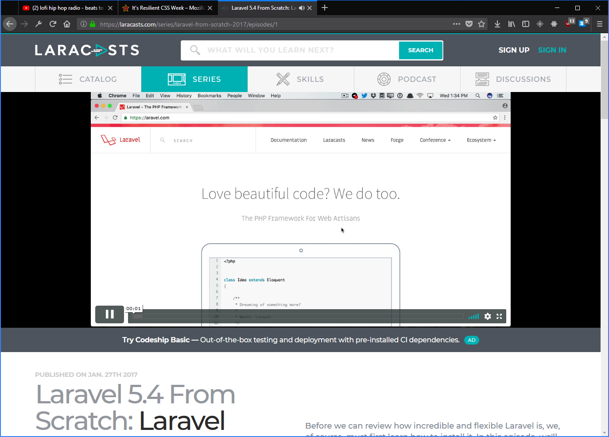

So yeah. The time has come to yell about Internet Positif again.

In case you missed it, Indonesia's Ministry of Communications (henceforth referred to as "Kemkominfo"), the powers that be in the advancement of information technology in the Republic of Indonesia, [has blocked Tumblr again](https://nasional.kompas.com/read/2018/03/06/17045671/kaget-menkominfo-belum-tahu-tumblr-diblokir), which doesn't surprise me personally. Kemkominfo has done this [a couple of](https://resir014.xyz/posts/2014/05/12/a-desperate-plea-for-internet-freedom/) [times already](https://resir014.xyz/posts/2016/02/17/tumblr-and-the-internet-positif-hammer/), all with varying degrees of inconsistency.

For those not in the loop, the Internet Positif censorship programme was headed by Menkominfo and implemented around 2014 by former head of Menkominfo Tifatul Sembiring (who, fun fact, still has me blocked on Twitter).

<figure>
  
</figure>

I've always complained how this whole Internet Positif programme is "borderline censorship", but then again, with Kemkominfo's increasingly trigger-happy behaviour over censoring online content within the past couple years, it's not as "borderline" as it used to, isn't it?

I literally have nothing to add here, I'm basically just repeating and amplifying all the things I've previously said, because let's be honest here, nothing has changed ever since.

## A three-part story of Kemkominfo still having no idea what they're doing

Again, Tumblr's story is just one of many which defines Kemkominfo's lack of transparency and frustrating inconsistency. It also shows their tone-deafness with regards to the modern technology that is the internet and how to prevent the possible outcome of its abuses.

Let me take you on a three-part journey of how we got here.

### Reddit

Reddit was the catalyst, the beginning of when Internet Positif took the Indonesian internet by storm. While it's true that these so-called "negative content" exist on Reddit, then again, *so do many other sites with user-generated content*.

Which is why Kemkominfo's reasoning behind its blocking is, in all parts, extremely weak. Pornography is never Reddit's primary priority, if anything, people who *desperately* wants porn would just go to Pornhub.

### Vimeo

Vimeo's blocking is where Internet Positif started to veer towards the downright bizarre. Again, Kemkominfo claimed the same bullshit "pornographic content" reasoning they used back when they blocked Reddit, therefore Vimeo must be a porn site. Which is far from the truth.

Vimeo is basically LinkedIn for video. Amateur and professional videographers alike showcase their work in a shared space for high-quality, entertaining, and amusing video content. Stuff like [this](https://vimeo.com/104945861), [this](https://vimeo.com/78716671), and even, [this](https://vimeo.com/8564338). A lot of them use Vimeo solely for their portfolio. And now their livelihoods are ripped apart by some baseless internet censorship initiative.

Even worse, a lot of programming tutorial videos are hosted on Vimeo. And by that, I mean *a lot*. [Laracasts](https://laracasts.com/) is a highly-popular resource for learning PHP and its ecosystem, most notably the [Laravel](https://laravel.com/) framework.

<figure>
  
</figure>

They host tons of screencasts, all of which are hosted on - you guessed it - Vimeo. Which means thanks to the Internet Positif filter, you'll see this.

<figure>
  
  <figcaption>See the difference? That's right, the video won't even load.</figcaption>
</figure>

I can't even refer my programming friends in Indonesia to any screencast materials on Laracasts without showing them how to circumvent Internet Positif as well. Apparently learning programming is now illegal now. Thanks Kemkominfo!

### Tumblr

And now it's time to address the big elephant in the room: Tumblr.

In case you forgot, Kemkominfo [had already attempted](https://resir014.xyz/posts/2016/02/17/tumblr-and-the-internet-positif-hammer/) to block this site before. Fortunately enough, there's enough amount of outrage, particularly from bloggers alike, which prompted them to reverse this decision.

Which is where I'm driving the point home. Besides shitposts, Tumblr is also commonly used by serious bloggers, particularly those in Indonesia. By killing Tumblr, you have potentially killed many bloggers' livelihoods who make their living off of ad revenue from their Tumblr-hosted blog.

## Telkom still profits off of it, somehow

Did you know that when your favourite website gets blocked, Telkom gets some revenue from the ads listed on their block page? It's true.

<blockquote class="twitter-tweet" data-lang="en">
dear <a href="https://twitter.com/kemkominfo?ref_src=twsrc%5Etfw">@kemkominfo</a> tiap kali laman diblokir, saya selalu dialihkan ke laman internetpositif. Di laman itu ada google ads, kemanakah uangnya mengalir?  Apakah negara memang berkontribusi memperkaya satu orang dengan memaksa seluruh warga mengakses lamannya? <a href="https://t.co/TeIiWNwNAu">pic.twitter.com/TeIiWNwNAu</a>
&mdash; lantip (@lantip) <a href="https://twitter.com/lantip/status/970888968555212800?ref_src=twsrc%5Etfw">March 6, 2018</a></blockquote>

When you access a blocked website through Telkomsel, you will be taken to their so-called "block page", located at [internetpositif.uzone.id](http://internetpositif.uzone.id). And that page is littered with Google ads. That's right, every telco providers (at the moment, [hopefully](https://twitter.com/SPangerapan/status/971197883641774081)) provide their own block page. Telkom decided to go the extra mile and merged their block page with their own "web portal" called Uzone, a site littered with unethical ads, and of course, SEO bullshit disguised as articles.

<blockquote class="twitter-tweet" data-conversation="none" data-lang="en">
gini lho, penapisan/blokir situs itu alasannya karena kontennya negatif. padahal saya mau mengakses situs tumblr yg bergerak tuk kegiatan sosial anak-anak. di vimeo jg banyak karya seniman kita. malah dialihkan ke laman isinya gini. masak <a href="https://twitter.com/kemkominfo?ref_src=twsrc%5Etfw">@kemkominfo</a> cuci tangan? <a href="https://t.co/ISYwO5g6yS">pic.twitter.com/ISYwO5g6yS</a>
&mdash; lantip (@lantip) <a href="https://twitter.com/lantip/status/971035239542902784?ref_src=twsrc%5Etfw">March 6, 2018</a></blockquote>

## Why even bother?

Pornography is never the primary destination for these website, and yet Kemkominfo tried to censor the entire website just because of 320 bad apples? Tumblr has millions of users, do you *really* need to block the entire website?

As I said on previous posts, this whole censorship does not benefit *anyone* whatsoever. Sure, you think you do it "for the best interests of the people", but in reality, you're just trying to undermine others' freedom of expression by acting out of your own gut and censoring online content in a single sweep without accounting for transparency. It hurts no one but the people who actually use these services *legitimately*.

Sure, you received "reports" about these "negative content", but let's take one step back and figure out this whole "user-generated" thing with me, shall we?

When you first signed up to Tumblr, Reddit, or any other sites with user-generated content, you get nothing at all in your dashboard. Nada. Zero. Then you begin following blogs that piqued your interests, until your dashboard is filled with many posts tailored to your preferences.

Any adult-rated content gets filtered out, which is why these websites have these so-called "safe mode". By default, it **will not** display any adult material unless you explicitly seek out for it. You need to dig *really* deep to find them. So we could guess how Kemkominfo claimed to have found them, and what they like doing in their spare time.

Yep. What a bunch of perverts.

---

I'll leave you with some words from one of my [older posts](https://resir014.xyz/posts/2016/05/12/indonesias-internet-censorship-two-years-on/). Next time this crap happens, I'm gonna link everyone back to it. Because at the end of the day, it's the same story.

> In the age of information, where the growth of technology is increasing exponentially, it is important to understand them well in order to help make a better environment for everyone, no exceptions. Unfortunately, there are still governments around the world that never seem to get the idea of how technology works in a global space, in fact **refusing** to accept the fact that technology is a global playground. They put forward their ego to clamp down on innovation in the digital landscape, and to further restrict the civil rights of its citizens.
>
> **The whole deal with censorship means that we have no forms of education teaching us what content is deemed suitable for children.**
>
> This is inherently bad, because it's the parents who should learn to decide what sites that their kids should and shouldn't visit. With censorship, we've basically pretended that these forms of "negative content" never even existed at all. And seeing how easy a web filter could be bypassed, a well-educated child will just circumvent those filters to find out for themselves.
>

There's no point going with the "shoot first, ask questions later" approach on internet safety. The internet is a global playground. There's no way you can block every single pornographic/radical/hateful website there is. It's the internet. If you block one, ten others will appear. The only way you can prevent children from visiting websites with pornographic content is to *educate them*.
