Netflix, the popular subscription-based streaming service, has been a topic of fierce discussion in Indonesia.

Recently, MUI is prepared to [issue a fatwa for Netflix](https://en.tempo.co/read/1298557/mui-ready-to-declare-netflix-as-haram), declaring it "haram". The new Ministry of Education [strikes a partnership deal with Netflix](https://twitter.com/Kemdikbud_RI/status/1215472091857739776), with the aim to improve Indonesia's film industry, and hopefully getting more Indonesian-made originals into Netflix's library. The Ministry of Informations and Communications [continue to](https://nasional.kompas.com/read/2020/01/07/11145911/menkominfo-minta-netflix-dan-telkom-duduk-bareng-soal-blokir) [be clueless](https://tekno.kompas.com/read/2020/01/10/10490087/beda-sikap-kominfo-dan-kemendikbud-soal-netflix-jadi-sindiran-warganet?page=all) on what to do with it. Whereas Telkom continues to block the service for fear it might compete with another streaming service they're partnering with, in an effort to undermine net neutrality in Indonesia. They won't admit it, but come on. Their reasoning of Netflix's blocking gets more and more senseless as time goes, we might as well believe that's the case.

If there's anything the Indonesian government loves to do, is fabricating "moral and norm panics" to try to keep the public's eyes free from so-called "negative" content. What kind of negative content, you say? Well, violence, pornography, LGBTQ+ issues, things they deemed not fit for the "conservative" values of some Indonesians, or even [hard truths](https://www.youtube.com/watch?v=QjU8R8oj328) not fit for your regular Indonesians' consumption. Their definition of "negative" is so broad that if something even falls vaguely to said categories, you get the _blocc_.

So in light of all that, here are 12 Netflix series that you can watch right now. I asked some of my friends for suggestions, checked them one by one, and we're _pretty sure_ they're free from the so-called "negative" content that our government loves to try and keep our innocent little eyes away from. Or, at least we hope it will. People nowadays have very weird eyes for detail, and they always find some negatives in even the most positive of shows.

Most of these shows are Netflix originals, but I'll try to mix in a few non-originals as well. I hope that we can spark joy into your lives by these 100%-guaranteed positive programmes, and provide you with a good backlog of series to watch before [the Ghibli inquisition](https://twitter.com/NetflixID/status/1219142156226629632) arrives.

## 1. Formula 1: Drive to Survive

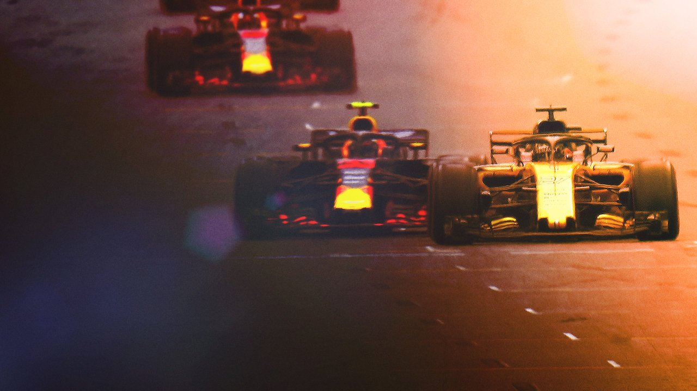

If you've been following my timeline, you know that I love motorsports, particularly [Formula 1](https://www.formula1.com/). So of course, I'm going to flex on my bias by putting a Formula 1 documentary on my list. _Formula 1: Drive to Survive_ gives you an all-access view behind the scenes of some of the teams and drivers competing in Formula 1. Season 1 covers the 2018 season, with the second season covering the 2019 season premiering in February.

**[Watch on Netflix](https://www.netflix.com/title/80204890)**

## 2. Our Planet

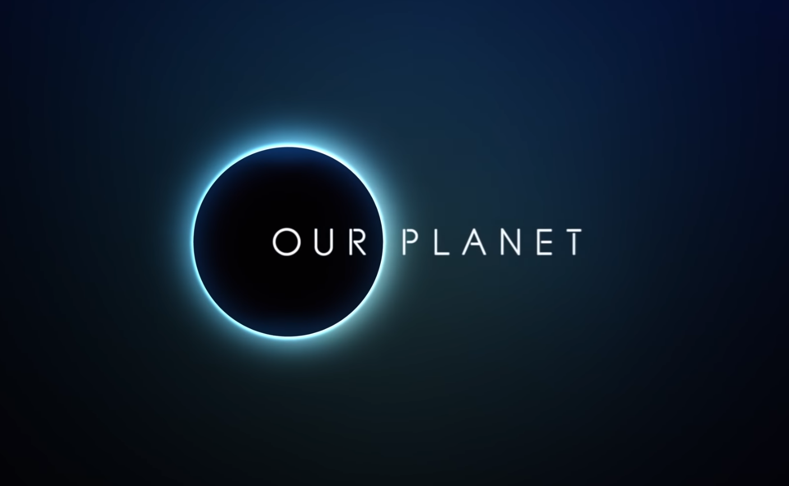

Narrated by the legendary David Attenborough, _Our Planet_ is a beautifully-shot nature documentary. It was produced by the same team who created the BBC series _Planet Earth_. No "negative" content from my view here, just raw, unfiltered shots of nature.

**[Watch on Netflix](https://www.netflix.com/title/80049832)**

## 3. Street Food

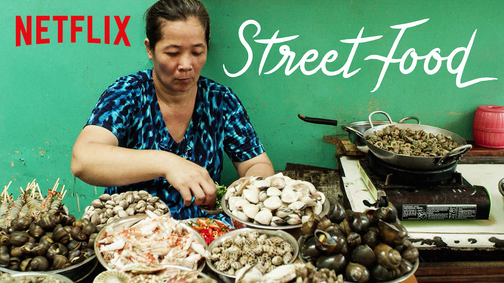

Everybody loves street food. From nasi goreng, bubur ayam, to chicken satay, we love some of that good, authentic street food experience. Which is why _Street Food_ invites you to experience different kinds of street food from different countries across Asia. Unless you count anything involving pork to be a "threat to Indonesian culture", nothing in this series can be considered "negative". Who hates food, anyway?

**[Watch on Netflix](https://www.netflix.com/title/80244996)**

## 4. The Great Hack

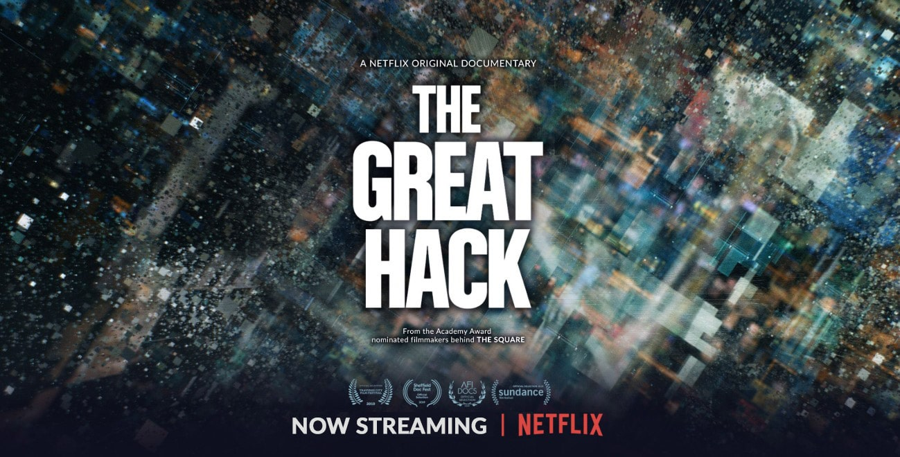

_The Great Hack_ explores how a data company named Cambridge Analytica came to symbolise the dark side of social media in the wake of the 2016 U.S. presidential election, as [uncovered by journalist Carole Cadwalladr](https://www.theguardian.com/news/2018/mar/17/data-war-whistleblower-christopher-wylie-faceook-nix-bannon-trump).

**[Watch on Netflix](https://www.netflix.com/title/80117542)**

## 5. Losers

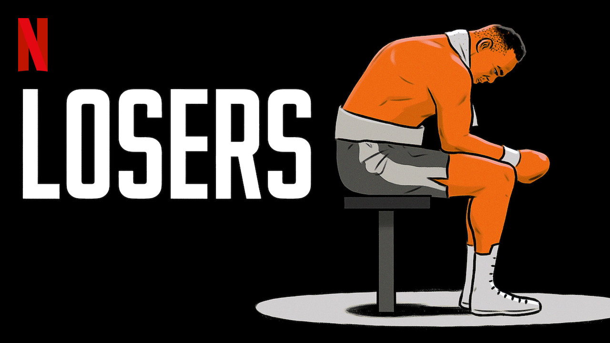

_Losers_ is series of documentaries about people/teams that have failed to live up to expectations or secure victory in their respective sports. For football-loving Indonesians, may I direct you to Episode 2, which covers Torquay United, the losingest football team in England.

**[Watch on Netflix](https://www.netflix.com/title/80198306)**

## 6. Tidying Up with Marie Kondo

Is your home a mess? Do you want to clean it up, but can't because there are many stuff you can't throw away because they hold sentimental value? Follow Japanese house cleaning legend Marie Kondo as she visits houses across the U.S. trying to help its residents to clean up their mess by showing her tips and tricks, all in _Tidying Up with Marie Kondo_.

**[Watch on Netflix](https://www.netflix.com/title/80209379)**

## 7. Aggretsuko

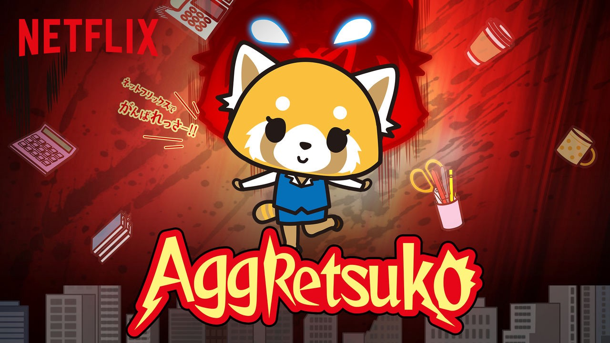

_Aggretsuko_ is an original anime musical comedy series based on a character created for Japanese mascot company Sanrio. It follows the story of Retsuko, a 25-year-old anthropomorphic red panda, who lets out her frustrations with everyday work by singing death metal at a karaoke bar.

**[Watch on Netflix](https://www.netflix.com/title/80198505)**

## 8. Hilda

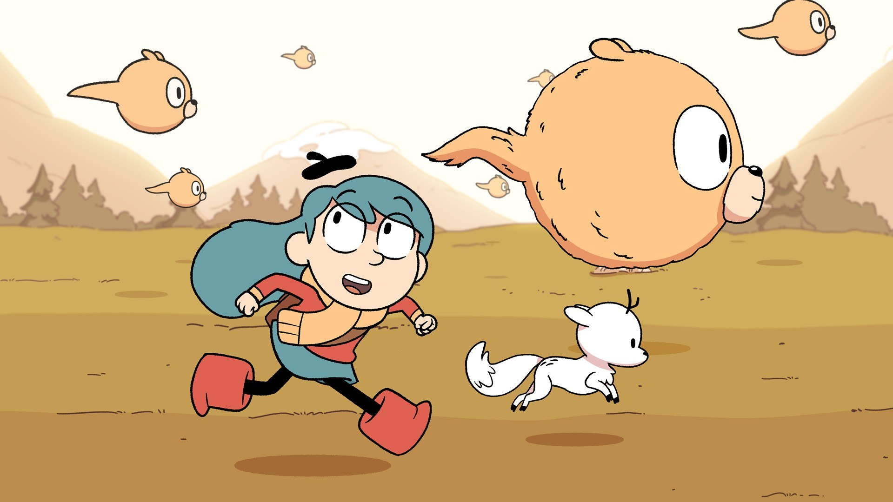

_Hilda_ is based on a graphic novel series of the same name by Luke Pearson. It's about a young girl named Hilda, who had to move away from her long-time hometown to a city called Trolberg, finding new friends and adventures. Kids' shows usually get a free pass for not being labeled as having "negative" content, so... here's one for your kids?

**[Watch on Netflix](https://www.netflix.com/title/80115346)**

## 9. WHAT DID JACK DO?

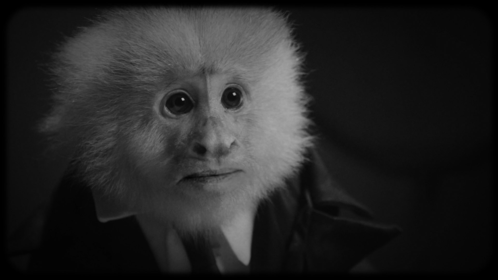

_WHAT DID JACK DO?_ is a short film directed by David Lynch, where a detective interrogates a monkey who is suspected of murder. According to [Polygon](https://www.polygon.com/2020/1/20/21074307/david-lynch-what-did-jack-do-netflix), "[the] film’s black-and-white look, with dirt and grain in the image, brings to mind Lynch's first feature, _Eraserhead_."

**[Watch on Netflix](https://www.netflix.com/title/81226955)**

## 10. Terra

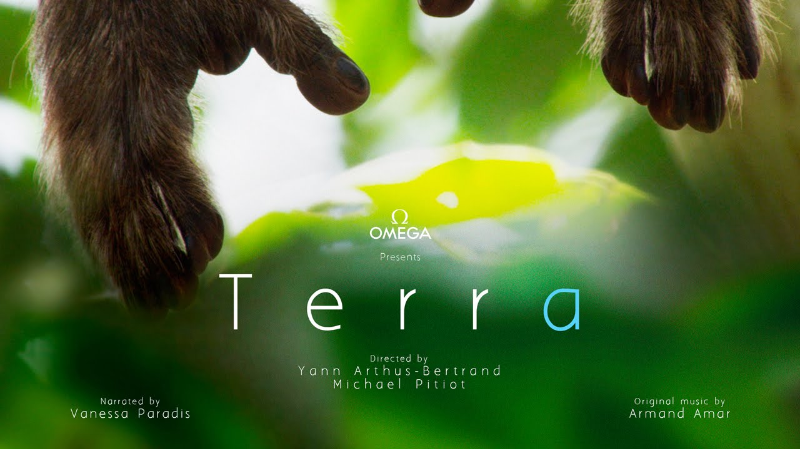

More nature documentaries, anyone? Terra is a visually stunning documentary that reflects human's relationship to other species on Earth as humanity becomes more and more isolated from nature. This one looks stunning judging from the trailer, and I can't wait to watch it.

**[Watch on Netflix](https://www.netflix.com/title/80102305)**

## 11. NiNoKuni

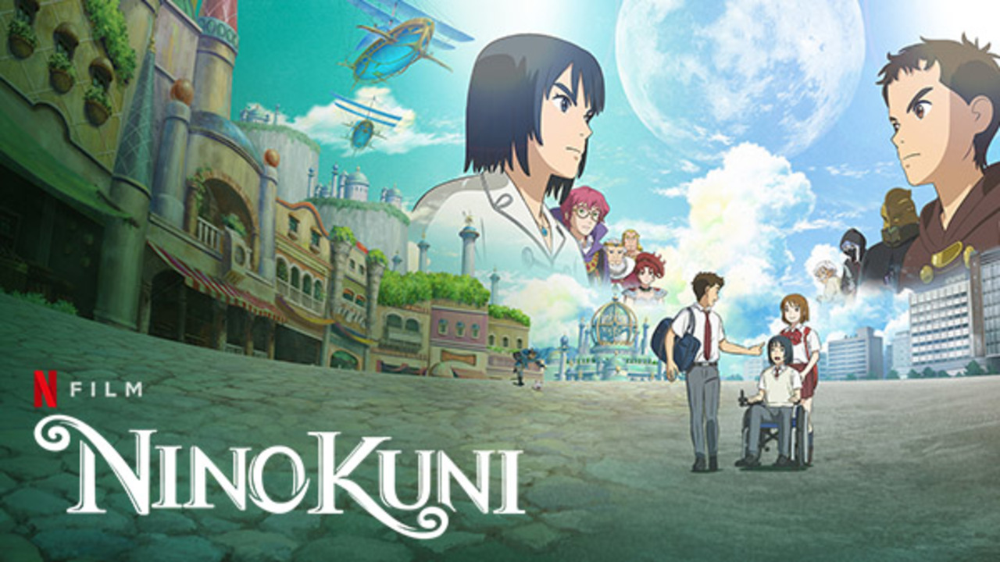

A film-based spin-off of a JRPG title of the same name, _NiNoKuni_ is one of the most hotly-anticipated new released coming onto Netflix this month.

**[Watch on Netflix](https://www.netflix.com/title/81093113)**

## 12. An Inconvenient Sequel: Truth To Power

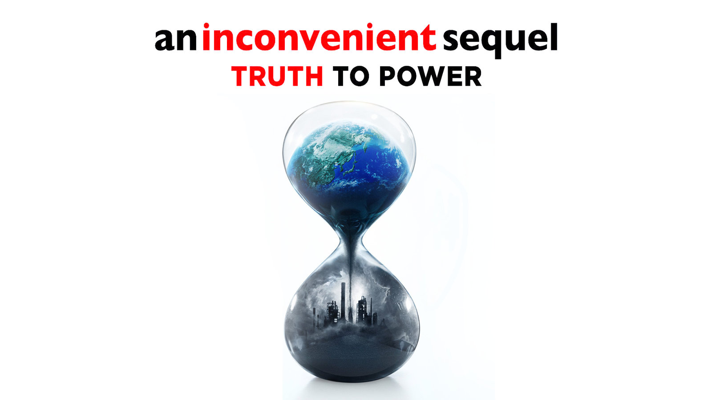

Remember [_An Inconvenient Truth_](https://en.wikipedia.org/wiki/An_Inconvenient_Truth)? It's a 2006 documentary by Al Gore showing us how we humans have truly messed up the planet. Its sequel, _An Inconvenient Sequel: Truth To Power_ outlines progresses made since the prequel, and try to pursue governmental leaders to tackle the problem once again.

**[Watch on Netflix](https://www.netflix.com/title/80170943)**
