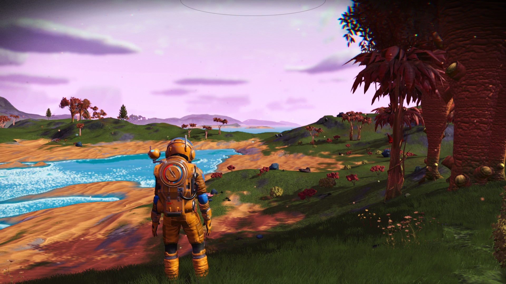
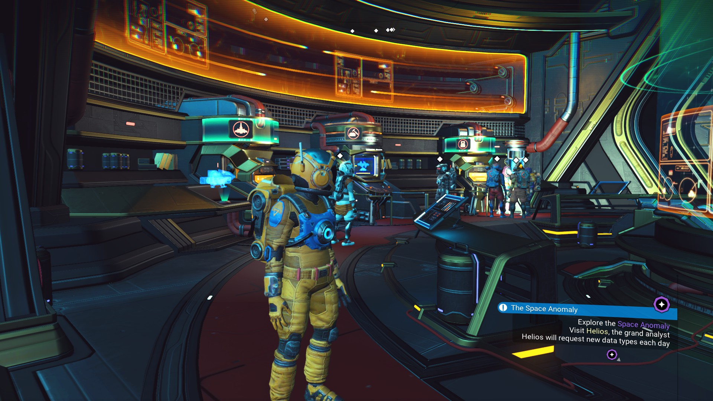
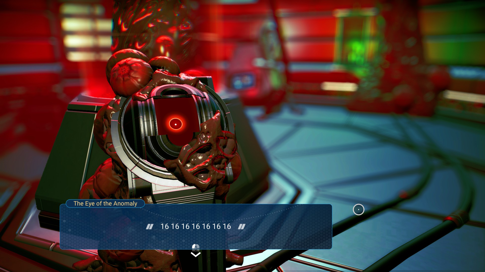

A few years ago, I wrote [a scathing review for No Man's Sky](https://resir014.xyz/posts/2016/10/15/open-world-space-exploration-games/).

I was one of the people who were super excited about it, but not to the point of riding on the hype. I didn't preorder it, nor do I have the money to buy the game on day one. But when the game was released and didn't go well, I did express my disappointment through that review.

No, I wasn't part of the toxic dogpiling the game has went through over nearly the entirety of its existence. But that was an entirely different topic beyond the scope of this post. I would just like to right the wrongs by outlining the genuine changes they have made over the past few years.

Throughout the years, I've been occasionally notified of the updates the Hello Games have made to the game. I followed their update logs occasionally, but didn't really think much about it. In fact, I did try a couple of the previous updates, but I never really went far.

So after the last update, and after [a certain video by Internet Historian](https://www.youtube.com/watch?v=O5BJVO3PDeQ) convinced me to give it another look, I decided to dust off my copy, start off with a clean save, trying to get a fresh experience into the game.

And boy, this game sure has improved a lot.

We all know the story about how this game went from the most anticipated game of all-time, to the punching bag of the gaming industry. Various press appearances by Sean Murray where he trailed off into making seemingly absurd promises in front of journalists. Not to mention signing a publishing deal with Sony and getting a wave of marketing material made for them.

This turned people's expectations for the game high up into the sky, despite Hello Games being an indie studio with only 13 employees, at the time of making the game. And Sean had to do a lot of press event with gaming outlets. Being a tech person, and not a PR person, Sean struggled to explain what the game will actually contain. And his words were taken in face by many journalists and the general public alike.

The deadline keeps coming closer, Sean keeps trailing off to making promises in press appearances, marketing materials keep getting pumped out by Sony, and expectations went up some more. It had the price of a AAA game too (\$60), so naturally, people will start having AAA expectations.

Then the game actually came out, and well... let's just say it underdelivered.

There’s a number of complaints I’ve had during my initial ordeal with No Man’s Sky. Terrible performance, uncomfortable FOV, awkward interface, repetitive gameplay, you name it. Like others, I was disappointed.

The video by Internet Historian goes on the same story, but also takes a look on Hello Games' side of the story. The No Man's Sky journey to launch is not easy. Floods that [ravaged through their offices](https://www.polygon.com/2014/3/11/5487564/hello-games-flood-recovery-interview), destroying most of their equipment. The [lawsuit by BSkyB](https://www.eurogamer.net/articles/2016-06-20-no-mans-sky-studio-settles-secret-stupid-three-year-sky-lawsuit), who claimed to own the world "sky". Not to mention signing a publishing deal with Sony and getting a wave of marketing material made for them, lifting expectations further up.

When the game was released, and it wasn't up to the already-high expectations, a lot of people were disappointed. Some were outraged. Hello Games experienced the worst of backlashes, from constant dogpiling towards Sean and the staff, even to the point of stalking the Hello Games offices at random hours.

They experienced all of the worst that the internet had to offer. But they sat down, and kept their head down. Sean ordered all his employees to not listen to the negative press and the horrible comments on the internet. Everything now goes through him. He filtered out the noise, and collected genuine feedback about what needs to be urgently worked on. He limited press appearances and all communications with the outside world, as they continue their work.

It took them several major updates to win back the trust of their customers, but with every update, their work became noticed by more people, and people started to rate the game positively again.

It really shows when I decided to finally have a go again. Everything feels more polished, the whole progression feels a bit more streamlined, there's an all-new story campaign as well. They brought in most of the things that were originally promised, and even brought in a suite of other new features that were never even promised in the first place!

<iframe width="560" height="315" src="https://www.youtube-nocookie.com/embed/ewq203-TXOs" frameborder="0" allow="accelerometer; autoplay; encrypted-media; gyroscope; picture-in-picture" allowfullscreen></iframe>

This video of Sean giving a talk at the GDC explains in full detail the story about his (and his whole teams') struggles to turn NMS around, from the punchline of the gaming industry to a decent space exploration game that everyone doesn't mind going back into. It's amazing really, they stuck to their beliefs and didn't perform a hard turn towards short-term gains, like what Bethesda have been doing with Fallout 76, with [paid subscriptions](https://falloutfirst.com/) and rushed updates that seem to [break multiple other things](https://www.youtube.com/watch?v=jliDdSFYGqI) alongside bugfixes.

Instead they sat down, and went back to work. And [it shows](https://www.nomanssky.com/atlas-rises-update) [in their](https://www.nomanssky.com/next-update/) [recent work](https://www.nomanssky.com/beyond-update/) [as well](https://www.nomanssky.com/synthesis-update/).

I suggest you give No Man's Sky another try. If you like a space-exploration game like Elite Dangerous, with additional elements like base building, space legs(!) and terrain manipulation, you'll feel right at home. And if you don't like that sort of game, that's fine. This genre is not for anyone, anyway.
