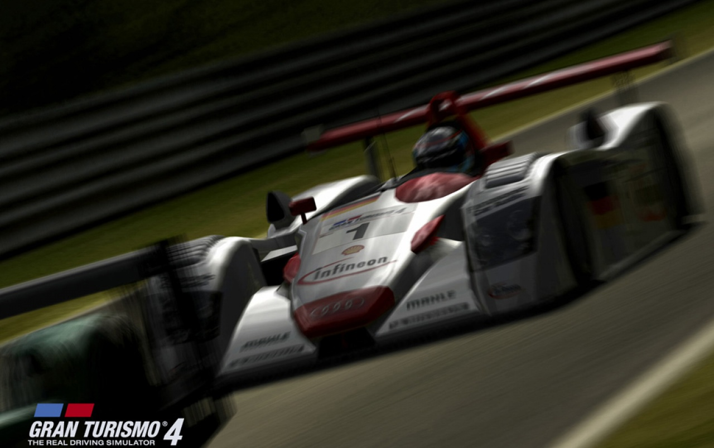
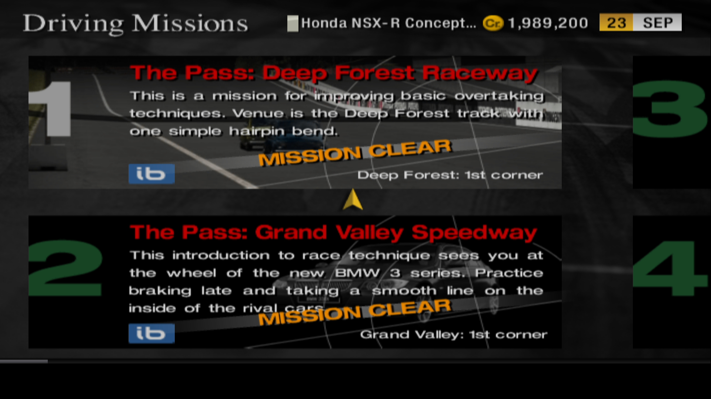

We truly live in a horrifying era. The [COVID-19 pandemic](https://www.who.int/emergencies/diseases/novel-coronavirus-2019) swept the world, and many countries have decided to go on quarantine to prevent the spread of this infectious disease. That means a lot of us are now confined to our homes, unable to leave due to the viral nature of this outbreak.

We can't hang out safely outside with our friends, meaning that many of us have to resort to alternative methods of communication, like voice and video calls. Many big events, including sporting events, are now also either postponed or cancelled, meaning a lot of our sources for entertainment during these times, are also gone. To put it mildly, everything sucks now.

But despite all this, there are still desperate measures for an alternative source of entertainment.

---

On the 27th of March 2020, four roommates set out to do something that one might say ridiculous. They decided to have a go at a speedrun category that has never been done before: the 100% No B-Spec category on Gran Turismo 4.

Let's meet our team. First we have Tyler (aka [thebook92](https://www.twitch.tv/thebook92)), the only guy in our team that has played GT4 in the past. The rest, Paul (aka [another_car_guy](https://www.twitch.tv/another_car_guy)), Jonah (aka [feathers51564](https://www.twitch.tv/feathers51564)), and Shawn (aka [sheeniethegee](https://www.twitch.tv/sheeniethegee)), have never played GT4 until they had their practice the week before. So you can tell this is going to end well.

<iframe src="https://clips.twitch.tv/embed?clip=TsundereAmorphousIguanaPipeHype&autoplay=false" frameborder="0" allowfullscreen="true" height="378" width="620"></iframe>

This doesn't come without preparation. As mentioned earlier, they had a practice session the week before, and they created a [checklist of things to do](https://docs.google.com/document/d/1214WhJ99hHWE0IBNugRnbh38bZA-hsLRc6k1vOQjMlM/edit?usp=sharing), so they didn't miss anything during their run. And many cans of Mountain Dew were probably involved as well.

---

[Gran Turismo 4](https://en.wikipedia.org/wiki/Gran_Turismo_4) was a racing simulation game released back in 2004. It featured over 700 cars from 80 different manufacturers all across the globe and 51 tracks, including the infamous Nurburgring Nordschleife. It's also the first Gran Turismo title to contain a 24-hour endurance race. Actually, not just one, there's [three](<https://gran-turismo.fandom.com/wiki/N%C3%BCrburgring_24h_Endurance_(GT4)>) [of](https://gran-turismo.fandom.com/wiki/Circuit_de_la_Sarthe_24h_I) [them](https://gran-turismo.fandom.com/wiki/Circuit_de_la_Sarthe_24h_II).

Not to mention the many races in its collection, from beginner to extreme events, special conditions events, regional events, to one-make race events from most of the licenced manufacturers that were included. So you might already think it will take a really, really long time to 100% the game. I'll let you take a guess on how long it will take.

100 hours? Nah.

150? Not even close.

How about 230 hours, 35 minutes, and 51.19 seconds?

That's right. Nine and a half days.

There's a reason why there are four people attempting this, because they're doing it in shifts. Of course, gaming for 230 hours solo, in one sitting, is not particularly good for your health. So to balance the load between them, they swap with each other after a certain number of hours. This is normally done in real-life racing as well, and is normally called a "stint".

This became more handy during the endurance races. Normally, races in Gran Turismo don't take that long, so that one person could take a number of races in one single stint. But with the endurance races going for up to 24 real, in-game hours, there could be multiple driver swaps throughout these races.

So, the stage is set for one the biggest speedrunning moments in 2020.

> [_"It's f\*\*kin' galaxy brain time, boys."_](https://clips.twitch.tv/PhilanthropicColdbloodedWalletDancingBanana)

---

Now, unfortunately I missed the first few days of the stream because I fell ill, so I couldn't review what happened during those times. But I did manage to start watching during the endurance race attempts, and status updates from other friends who also watched the stream kept me informed during my downtime.

To 100% Gran Turismo 4, you will need to complete all licence tests, complete all driving missions, and win all races, including the one-make and endurance races. You can only do it on an original PS2 with the disc, which means emulators aren't allowed.

Licence tests will allow you to compete in events where you will need a certain licence, so it's a sensible move to start the run here. Completing licence tests will give you either a Gold, Silver, or Bronze medal, depending on the time you completed them. Note that you didn't need to win Gold medal on all the licence tests - it's imaginable if that an All Golds run were necessary, the run may have taken 10 days.

Next on the list, the Driving Missions. These are 34 challenges that tests the players skills in several racing techniques, such as overtaking, clean racing, and slipstreaming.

This ends with [Mission 34](https://www.youtube.com/watch?v=Gl84Rle6Yuw), where they have to chase down a series of historical Mercedes-Benz cars around the Nurburgring Nordschleife, with a 2-minute start delay. This is the ultimate test of driving skill, and many people would take a lot of time to complete this even on a non-speedrun setting.

Worse still, they're playing on the NTSC-U version of the game, which is notoriously more difficult with Mission 34 than its PAL and NTSC-J counterparts. The pressure was too much for them, so they had to abandon Mission 34 and set it aside for the finale. We'll get back to this later.

[still need to figure out how to do this part]

They've had so many struggles, from the Beetle Cup, to their song requests queue getting filled up with meme songs, to various close calls, to a PS2 crash that took 20 minutes off their time. As they pressed on, they got everything out of the way, including the endurance races and one-make championships.

6th of April, 2020. Day 10. 228 hours on the clock. The final showdown. It's time to take on Mission 34.

<iframe src="https://clips.twitch.tv/embed?clip=GrotesqueInspiringLegMikeHogu&autoplay=false" frameborder="0" allowfullscreen="true" height="378" width="620"></iframe>

As mentioned earlier, they were meant to do this during the first hours in their route but they had so many issues, so they decided to put the final Driving Mission aside for the finale.

Many attempts, many close calls. The stress was real.

<iframe src="https://clips.twitch.tv/embed?clip=AcceptableNurturingJackalTooSpicy&autoplay=false" frameborder="0" allowfullscreen="true" height="378" width="620"></iframe>

<iframe src="https://clips.twitch.tv/embed?clip=PeppyScrumptiousCurlewTooSpicy&autoplay=false" frameborder="0" allowfullscreen="true" height="378" width="620"></iframe>

And then on 4:22am, this happened.

<iframe src="https://clips.twitch.tv/embed?clip=ObliviousProductivePeafowlWutFace&autoplay=false" frameborder="0" allowfullscreen="true" height="378" width="620"></iframe>

They did it. They achieved 100% completion in Gran Turismo 4 after 230 hours of non-stop streaming. Celebrations erupted in the Twitch chat. They had done what nobody has done before.

The run has now been immortalised on the [speedrun.com leaderboards](https://www.speedrun.com/gt4/run/z053w5em), and as of the time of writing, remains the only 100% No B-Spec run of Gran Turismo 4.

---

This post might not be the most coherent one I've written this year, but I just wanted to write a quick tribute to what might possibly the best, most entertaining week I've had in 2020. In these darkest hours, we can still do great things and entertain people across the globe.

We are all coping with the COVID-19 outbreak one way or another. Be it through [clapping for the heroes](https://www.bbc.com/news/av/uk-52234176/coronavirus-uk-claps-for-nhs-carers-and-key-workers) working in the frontline, [esports replacements](https://www.youtube.com/watch?v=NAKbRmLfmjI) to various sports events, or even a nonstop speedrun marathon. This too shall pass. But we're not dealing with this without a fight, don't forget to wash your hands, follow the WHO's guidelines on slowing down this outbreak, and listen to your local authority's instructions on any social distancing measures given to your community.

So to Tyler, Paul, Jonah, and Shawn, thank you for your service.
