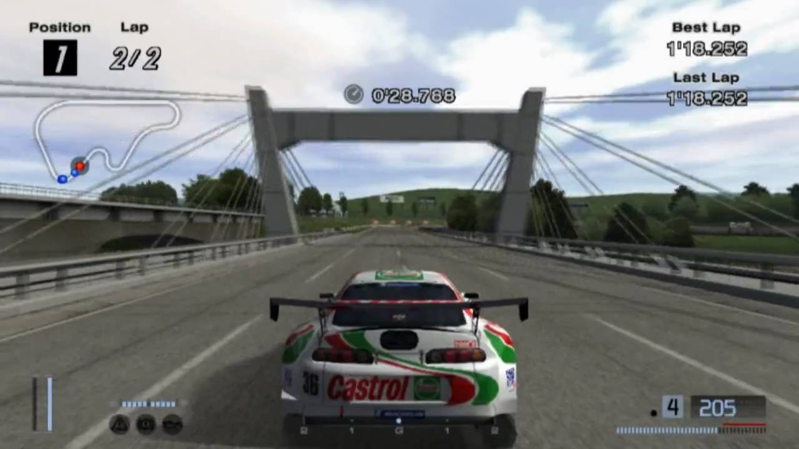

We truly live in a horrifying era. With the [COVID-19 pandemic](https://www.who.int/emergencies/diseases/novel-coronavirus-2019) still not showing any signs of slowing down, and many countries going on lockdown to prevent the spread of this infectious disease, a lot of us are now confined to our homes, unable to leave due to the viral nature of this outbreak.

We can't hang out safely outside with our friends, meaning that many of us have to resort to alternative methods of communication, like voice and video calls. Many big events, including sporting events, are now also either postponed or cancelled, meaning a lot of our sources for entertainment during these times, are also gone. To put it mildly, everything sucks now.

There are many ways people cope with the lockdown, including trying out things that they have never done before. And for four roommates being confined to their room in a lockdown, that's something they set out to do.

---

On the 27th of March 2020, four roommates set out to do something that one might say ridiculous. Something that no human on the planet would even remotely think of it as being a feasible thing to do. They decided to have a go at a speedrun category that has never been done before: the 100% No B-Spec category on Gran Turismo 4.

[Gran Turismo 4](https://en.wikipedia.org/wiki/Gran_Turismo_4) was a racing simulation game released back in 2004. It featured over 700 cars from 80 different manufacturers all across the globe and 51 tracks, including the infamous [Nurburgring Nordschleife](https://en.wikipedia.org/wiki/N%C3%BCrburgring). It's also the first Gran Turismo title to contain a 24-hour endurance race. Actually, not just one, there's [three](<https://gran-turismo.fandom.com/wiki/N%C3%BCrburgring_24h_Endurance_(GT4)>) [of](https://gran-turismo.fandom.com/wiki/Circuit_de_la_Sarthe_24h_I) [them](https://gran-turismo.fandom.com/wiki/Circuit_de_la_Sarthe_24h_II).

Not to mention the many races in its collection, from beginner to extreme events, special conditions events, regional events, to one-make race events from most of the licenced brands that were included. So you might already think it will take a really, really long time to 100% the game. I'll let you take a guess on how long it will take.

100 hours? Nah.

150? Not even close.

How about 230 hours, 35 minutes, and 51.19 seconds?

That's right. Nine and a half days.

---

<!-- prettier-ignore -->
Let's meet our team. First we have Tyler (aka [thebook92](https://www.twitch.tv/thebook92)), the only guy in our team that has played GT4 in the past. The rest, Paul (aka [another\_car\_guy](https://www.twitch.tv/another_car_guy)), Jonah (aka [feathers51564](https://www.twitch.tv/feathers51564)), and Shawn (aka [sheeniethegee](https://www.twitch.tv/sheeniethegee)), have never played GT4 until they had their practice the week before. So you can tell this is going to end well.

The COVID-19 lockdown might be part of the reason this run attempt came to be, but Tyler did mention in a post-stream Q&A session that this run is what he has always wanted to do - the lockdown provided them with an opportunity to complete this run once and for all.

<iframe src="https://clips.twitch.tv/embed?clip=TsundereAmorphousIguanaPipeHype&autoplay=false" frameborder="0" allowfullscreen="true" height="378" width="620"></iframe>

In Gran Turismo 4, you can do races in two modes; A-Spec, where you physically drive the car, and B-Spec, where you enter the "director's mode" and let the AI take over from you, whilst also giving instructions on whether to push harder, reduce the pace a bit, or enter the pits. In this mode you can also run the game at up to 3x speed, which can drastically reduce the time to complete a race. However, the category that they're running is No B-Spec mode, which means you can never use the B-Spec mode in your run, ever.

There's a reason why there are four people attempting this, because they're doing it in shifts. Of course, gaming for 230 hours solo, in one sitting, is not particularly good for your health. So to balance the load between them, they swap with each other after a certain number of hours, or if someone needs a break. This is normally done in real-life racing as well, and is normally called a "stint".

This became more handy during the endurance races. Normally, races in Gran Turismo don't take that long, so that one person could take a number of races in one single stint. But with the endurance races going for up to 24 real, in-game hours, there could be multiple driver swaps throughout these races.

This doesn't come without preparation. As mentioned earlier, they had a practice session the week before, and they compiled [a route list](https://docs.google.com/document/d/1214WhJ99hHWE0IBNugRnbh38bZA-hsLRc6k1vOQjMlM/edit?usp=sharing), which became a checklist throughout their run so they didn't miss anything. And many cans of Mountain Dew were probably involved as well.

So, we got the players, and we got a battle plan. The stage is set for one the biggest speedrunning moments of 2020.

> [_"It's f\*\*kin' galaxy brain time, boys."_](https://clips.twitch.tv/PhilanthropicColdbloodedWalletDancingBanana) - Jonah

---

Now, unfortunately I missed the first few days of the stream because I fell ill, so I couldn't review in-depth what happened during those times. But I did manage to start watching during the endurance race attempts, and status updates from other friends who also watched the stream kept me informed during my downtime.

To 100% Gran Turismo 4, you will need to complete all licence tests, complete all driving missions, and win all races, including the one-make and endurance races. You can only do it on an original PS2 with the disc, which means emulators aren't allowed.

Licence tests will allow you to compete in events where you will need a certain licence, so it's a sensible move to start the run here. Completing licence tests will give you either a Gold, Silver, or Bronze medal, depending on the time you completed them. Note that you didn't need to win Gold medal on all the licence tests - it's imaginable if that an All Golds run were necessary, the run may have taken 10 days.

Next on the list, the Driving Missions. These are 34 challenges that tests the players skills in several racing techniques, such as overtaking, clean racing, and slipstreaming. You will also get money and prize cars after completing certain missions.

This ends with the infamous [Mission 34](https://www.youtube.com/watch?v=Gl84Rle6Yuw), where they have to chase down a series of historical Mercedes-Benz cars around the Nurburgring Nordschleife, with a 2-minute start delay. This is the ultimate test of driving skill, and many people would take a lot of time to complete this even on a non-speedrun setting.

Worse still, they're playing on the NTSC-U version of the game, which is notoriously more difficult with Mission 34 than its PAL and NTSC-J counterparts. The pressure was too much for them, so they had to abandon Mission 34 and set it aside for the finale. We'll get back to this later.

After the licence tests and missions, it's time to do the race events. Beginner events are the starting point of your Gran Turismo career, with some of these events not requiring a licence to enter. Professional events are where the events start to grow progressively harder. This ends with the Gran Turismo World Championship, where the Any% category of this game would normally end. There are also the Special Conditions events, which was just a fancy way of saying "rally events".

The endurance races were unlocked when you reach 25% completion of the game. Endurance races come in two types. There are distance-based endurance races, which has a fixed number of laps, and time-based endurance races, where the driver with the most laps after a certain amount of time has elapsed wins. As previously mentioned, there are three 24-hour races, not to mention other time-based races of varying distances. To optimise their run, they will have to finish the race as close to their alloted time as possible.

So for example, if it's a 4-hour endurance race, they will have to try to take the chequered flag close to the 4-hour time. If they undershot, they will have to do another lap, potentially losing valuable time.

The Nurburgring 24-hour endurance race was the first endurance race they completed, because this unlocks the Formula GT, a Formula 1-like car which is one of the fastest cars in the game. This is where they can complete the rest of the endurance races, as well as some Professional and Extreme racing events, including the Formula GT championship.

Their route involved doing the races that would be the most profitable for them, while getting to the 25% threshold to unlock the 24 Hours of Nurburgring, intending to earn 1 and a half million credits from the game's events in order to unlock the Nissan Motul Z - the car they would use to take on the behemoth of the Nordschleife for a whole day.

At hour 67, they unlocked the Formula GT. From there, they would spend over 100 hours in that machine, racking up nearly 10000 miles on its odometer.

<iframe src="https://clips.twitch.tv/embed?clip=BillowingAwkwardAlfalfaBatChest&autoplay=false" frameborder="0" allowfullscreen="true" height="378" width="620"></iframe>

From there, they cleared off the high-speed events in the Bentley Speed 8, that wouldn't require the same amount of control as the Formula GT car, and just needed raw power. After that, it was onto the one-make races.

As they went down the list, the list of races required fell towards 0. The events of Chevrolet, BMW, Alfa Romeo, Mercedes, Renault, Mazda, Nissan, Daihatsu, Honda, Isuzu, Mitsubishi, Suzuki, Chrysler, Toyota, Audi, Volkswagen, Lotus, Aston Martin, Mini, TVR, MG and the Triumph should have spelt the end.

But they still had to go back into the depths of hell.

The Green Hell.

---

6th of April, 2020. Day 10. 228 hours on the clock. The final showdown. It's time to take on Mission 34. The final boss, if you may. If they win this Mission, their run is complete.

Tyler, being the most experienced of the four, was repeatedly called upon to attempt to save races, frequently on little sleep. This included a Hong Kong race in the Formula GT vs. Group C cars, going a lap down at Motegi Road Course and needing to bring the deficit back, among several others. Sleep-deprived as he already is at this point of the run, he took the wheel one last time.

<iframe src="https://clips.twitch.tv/embed?clip=GrotesqueInspiringLegMikeHogu&autoplay=false" frameborder="0" allowfullscreen="true" height="378" width="620"></iframe>

As mentioned earlier, they were meant to do this during the first hours in their route but they had so many issues, so they decided to put the final Driving Mission aside for the finale.

Many attempts, many close calls. The stress was real.

<iframe src="https://clips.twitch.tv/embed?clip=AcceptableNurturingJackalTooSpicy&autoplay=false" frameborder="0" allowfullscreen="true" height="378" width="620"></iframe>

<iframe src="https://clips.twitch.tv/embed?clip=PeppyScrumptiousCurlewTooSpicy&autoplay=false" frameborder="0" allowfullscreen="true" height="378" width="620"></iframe>

And then on 4:22am, this happened.

<iframe src="https://clips.twitch.tv/embed?clip=ObliviousProductivePeafowlWutFace&autoplay=false" frameborder="0" allowfullscreen="true" height="378" width="620"></iframe>

They did it. They achieved 100% completion in Gran Turismo 4 after 230 hours of non-stop streaming. Celebrations erupted in the Twitch chat as Tyler accepts the Formula GT Black Edition prize car to stop the timer. They had done what nobody has done before.

The run has now been immortalised on the [speedrun.com leaderboards](https://www.speedrun.com/gt4/run/z053w5em), and as of the time of writing, remains the only 100% No B-Spec run of Gran Turismo 4.

---

We are all coping with the COVID-19 outbreak one way or another. Be it through [clapping for the heroes](https://www.bbc.com/news/av/uk-52234176/coronavirus-uk-claps-for-nhs-carers-and-key-workers) working in the frontline, [esports replacements](https://www.youtube.com/watch?v=NAKbRmLfmjI) to various sports events, or even a nonstop speedrun marathon. This too shall pass.

But we're not dealing with this without a fight, don't forget to wash your hands, follow the WHO's guidelines on slowing down this outbreak, and listen to your local authority's instructions on any social distancing measures given to your community.

In these darkest hours, we can still do great things and entertain people across the globe.

So to Tyler, Paul, Jonah, and Shawn, thank you for your service.

---

_Thanks to [@soccnotsoc](https://twitter.com/soccnotsoc) for their help in proofreading and fact-checking this article._
