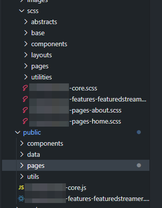

_Header image by [Olav Ahrens Røtne](https://unsplash.com/photos/MAEbdaFe4ps) on Unsplash._

There's been a lot of Discourse™ in the frontend landscape after [this thread](https://twitter.com/sstephenson/status/1272608076433166336), announcing a new email client called [HEY](https://hey.com/), was published. In it, they dove deep into HEY's tech stack, and further boasted about its capabilities. This started further debate on the unique path HEY has taken, and whether or not "better" tech stack is a feature.

I've written [a couple](https://medium.com/@resir014/why-you-moved-from-angular-2-to-vue-js-and-why-you-didnt-understand-what-react-is-about-107ea9188912) [of times](https://resir014.xyz/posts/2019/07/30/no-typescript-isnt-a-waste-of-time/) lamenting about the tendency of people starting framework/language wars time and time again. The reality is that your choice of frontend stack doesn't matter that much anymore. It always frustrates me every time people write opinion thinkpieces disguised as "objective" "facts" about how one framework, or language, is better than the other.

---

I've been on the web development landscape for 6-7 years now. I've seen frameworks, technologies, and libraries come and go. I've tried all 4 of the Big Frameworks, and understood what each of their benefits are.

I've done a lot of framework-hopping before eventually settling on React. From [Angular](https://angular.io/) I became addicted to [TypeScript](https://www.typescriptlang.org/). From [Vue](https://vuejs.org/) I learned how better developer tools can significantly improve the developer experience. And from [React](https://reactjs.org/) I could get down and dirty with business logic more comfortably.

I've recently tried learning Svelte, and have been doing so while livestreaming to my [Twitch channel](https://www.twitch.tv/resir014), which you can view the entire series [here](https://www.twitch.tv/collections/4SmikxhFFRZGXw). Over time, I've seen the advantages of it, as well as some neat features that literally made my jaw drop.

As much as these frameworks benefits are useful, they're _not_ mutually exclusive.

Let me explain.

---

I've been working on a static website as a side project lately. Since our deployment environment is very limited, I had to be creative and include a mix of old and new tools.

For example, I've decided to get back to [Gulp](https://gulpjs.com/) and improve the site's build pipeline. Gulp has improved a lot since v4 came out, and this allows me to include the best of old and new in one build pipeline.

This allows me to rewrite most of the outdated ES5 code into mostly vanilla ES6. It's not always vanilla though. Thanks to [Browserify](http://browserify.org/) we can now include the best of the JavaScript ecosystem into our stack. For example, there's an interactive widget that is written in [Preact](https://preactjs.com/).

Code-splitting is done entirely manually, with each top-level styles and scripts compiled to their separate files. This forces me to actually write proper modular code, where, I split the styles/scripts between core modules and page/feature-specific modules. I've devised a custom file naming scheme to figure out which one is which.

This of course means that every part of the code can be included on-demand.

I haven't written pure SCSS for a while now, and ever since then, the CSS ecosystem has improved significantly. I've combined the best of SCSS (nesting, mixins, etc) with the best features that are already in CSS today (custom properties, grid, etc.). I then run everything through [PostCSS](https://postcss.org/) to down-compile these features to something that's supported by popular browsers.

I kinda miss the old way of building websites. But I also have been spoiled by the developer experience of modern tools.

So why can't we have the best of both?

---

We have been spoiled by Good Developer Experience™ with these modern frameworks, we tend to forget that in the real world, _user experience_ always wins over _developer experience_. Just being able to run `yarn dev` and getting your new app running in a day doesn't solve user's pain points like user experience, accessibility, etc. All of these require attention to detail and TLC.

It's what I've been realising when building that project as well. It's that you _can_ combine the best of old and new if it further improves the user experience.

But do take note that this does **not** mean that we have to force everyone to party like it's the 90s. Different companies have different solutions, different user needs, pain points, etc. Feel free to continue on using React, Vue, Angular, and any other modern framework you like. Feel free to stick to the Old Way™️ of doing things. Just remember that choosing a stack is half the battle.

Because a tech stack is _not_ a feature. The way you solve your users' needs is the _real_ feature.
