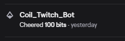
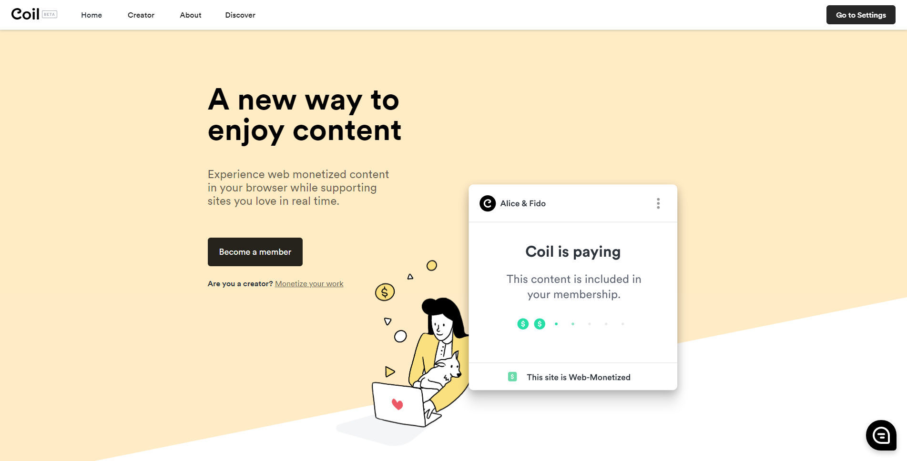
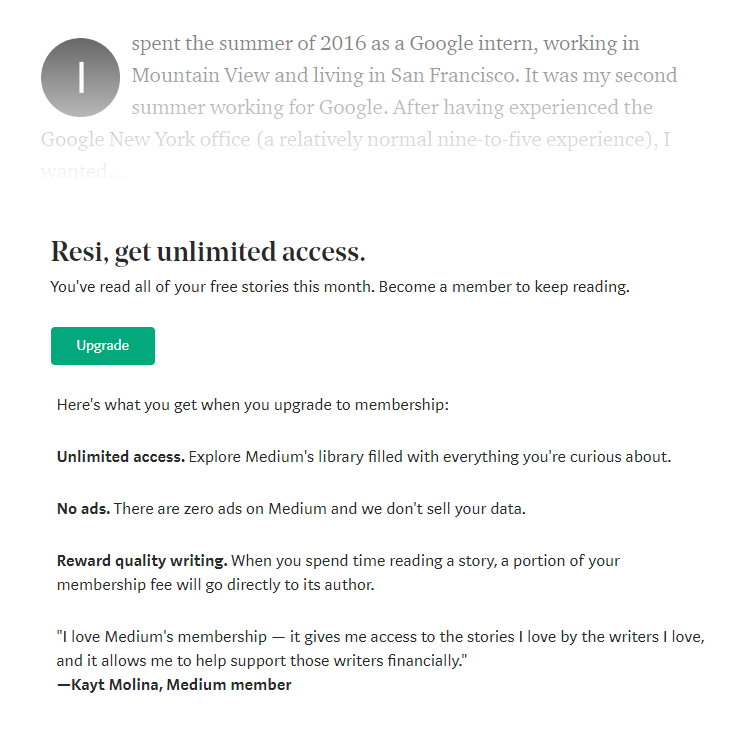

If you're a streamer and you looked into your Twitch Dashboard's activity log lately, chances are you might have seen cheers of at least 100 bits from a user named `Coil_Twitch_Bot`. And you're probably wondering to yourself who it's from, and why it's doing it.



Short answer, it's from [Coil](https://coil.com/). Long answer, we need to talk about the Web Monetization API.

---

The bot, and its donation you're seeing is the result of an upcoming web spec called the Web Monetization API, and one of the services which have been adopting it, Coil.

In a nutshell, [Web Monetization API](https://webmonetization.org/) is a new spec for the web which allows your website/app to receive a stream of small payments from the user, based on the [Interledger](https://interledger.org/) protocol. If you connect to a Web Monetization-enabled content on the internet, through a supported browser/platform, you will support the content you're reading by making micropayments to the content creator in the background.

This is a brand-new web API, and is still being proposed as a W3C standard at the Web Platform Incubator Community Group. However, services like Coil and a number of payment providers as well as browsers have included built-in support for this API.

To make your website/app support Web Monetization, simply add the following meta tag to your website:

```html
<meta name="monetization" content="$YOUR_WALLET_URL" />
```

Using the [JavaScript API](https://webmonetization.org/docs/api), you can then make your website behave differently for users who have Web Monetization enabled on their client. For example, removing ads, or even unlocking paywalled content for them.

Or, you don't even have to do anything! You can set up Web Monetization to provide passive monetisation for your website/app as well.

---

But what does this have to do with Coil though?

Well, Coil provides a way to support the content you enjoy by allowing you to make micropayments to sites which support them. And it all happens through the power of Web Monetization API.



You become a Coil member by paying a flat \$5/month fee. Once a member, you can download their extension to enable the power of Web Monetization through Coil on your browser.

When a website has Web Monetization enabled, your extension will start making micropayments every second to the website owner's wallet. Currently, the wallets that support Web Monetization are [Uphold](https://uphold.com/), [Gatehub](https://gatehub.net/), [Stronghold](https://stronghold.co/real-time-payments#coil), and [XRP Tipbot](https://www.xrptipbot.com/).

But what about Twitch streams then? How are you receiving that bits donation from Coil's bot?

Coil [works natively on Twitch](https://help.coil.com/for-creators/twitch-stream), too! If you are an affiliated or partnered Twitch streamers, you don't need to set anything up, since payouts from Coil members are provided through [Twitch Bits](https://www.twitch.tv/bits). If you have Coil members watching your stream and they have the extension installed, it'll collect micropayments the same way over time, and pays it out via bits periodically.

---

Let's face it, monetizing content on the web is broken, and the current solution available leaves the entire user experience on the web worse off. The only way you support content creators and journalists for their work nowadays is broken. They make you go into one of the web's many walled gardens, and force you to make separate payments over many different walled gardens you go into.

But that shouldn't be how monetisation works on the internet. It should work the same, every time, everywhere.



Web Monetization API makes monetising content on the Internet open, global, and respects your privacy. I really want this to be the future of the internet, and Coil is taking steps towards it.

I don't want to make this seem like a sponsored post, but I really believe in Web Monetization API and I really want to see Coil succeed. If you want to support your favourite Twitch streamers as well as many other content on the internet, consider subscribing to [Coil](https://coil.com/). It's only \$5 per month, which is a great deal.
