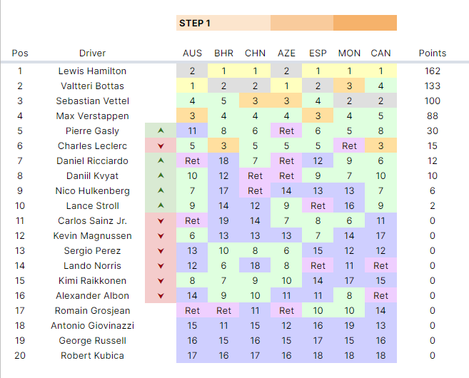

Trackmania, despite having a dedicated community behind it, has always had a rather modest esports scene. Throughout the game's existence, all esports competitions have been held by other organisations, with varying levels of prominence. These range from for-fun competitions held by clans, to national, or global events with big organisations behind it.

It used to be a staple event at the [Electronic Sports World Cup (ESWC)](https://liquipedia.net/trackmania/ESWC) until it was dropped in 2015. After years of absence, a global-level tournament comes back to the Trackmania esports scene, with the advent of the Trackmania Grand League.

[Trackmania Grand League (TMGL)](https://trackmania-grand-league.com/) is the premier esports competition in the Trackmania community. It was officially hosted by [Ubisoft Nadeo](https://nadeo.com/), the makers of the game. It's where 16 of the best Trackmania players in the world pit against each other in maps of different styles, comprising of many different road surfaces, with one of them bring crowned as the world champion.

The maps of TrackMania are full of twists and turns, loops and wallrides, and it takes a lot of precision for even the high-level professional players to be just an inch faster from their other rivals.

And when you see these pro players play the game, oh boy.

<iframe src="https://clips.twitch.tv/embed?clip=HotTransparentTermiteCclamChamp&parent=resir014.xyz&parent=motorsport101.com&parent=deploy-preview-139--resir014.netlify.app" frameborder="0" allowfullscreen="true" scrolling="no" height="378" width="620"></iframe>

There are many things that are unique to TMGL, one of them is the controversial point-loss system, introduced for the Fall 2020 season. This has been a topic of hot debate on the Trackmania community. Some people think it's complete bullshit, others think it's fine as long as you get used to it.

Over the past few weeks, I have been taking part in the Open Grand League (OGL). This is the portion of TMGL that's open for all players, where the top 8 players at the end of the league will get a chance to play against the TMGL players in the Combined Match.

While I have no strong feelings one way or the other about the point-loss system, I wondered what it would look like if the same system is implemented on a real-life motorsport series. So I decided to do that with last year's F1 season.

Strap yourselves in, folks. We're heading into unknown territory.

---

## How TMGL works

TMGL consists of 6 matchdays span over 6 weeks, known as "steps". Each "step" has 6 rounds, 2 regular rounds, 2 "semi-final phase" rounds, and 2 "final phase" rounds.

In the first 2 races of the step, the "Opening" phase will commence. During the Opening phase, points are awarded as usual.

<blockquote>

The first two maps are played in the first phase of the step called «Opening», players that finish from the 9th to 16th place do not lose any points gained.

<cite>— <a href="https://trackmania-grand-league.com/uploads/2019/01/RULEBOOK_TMGL_CIRCUIT_2020-2021.pdf">TrackMania Grand League rulebook</a>, section 4.3.2 "Point distribution"</cite>
</blockquote>

The next 2 races will be used for phase 2 of the step, known as "Semi", or semi-final phase. During the Semifinal phase, everyone who finishes in the bottom half have their points cut in half. Any fractional numbers resulting from the point loss are rounded up to the nearest integer.

<blockquote>

Map three and four are used in phase two of the step called «Semi», players that finish from the 9th to 16th place lose half of their points gained on the previous maps. All resulting fractional numbers are rounded up to the nearest integer.
<cite>— <a href="https://trackmania-grand-league.com/uploads/2019/01/RULEBOOK_TMGL_CIRCUIT_2020-2021.pdf">TrackMania Grand League rulebook</a>, section 4.3.2 "Point distribution"</cite>
</blockquote>

This leaves races 5 and 6 of the step, the "Final" phase. During the final phase, the same thing happens like the semi-final phase, but instead of losing half of their points, they lose all the points they accrued so far.

<blockquote>

The last two maps are part of the last phase of the step called «Final» where players that finish from the 9th to 16th place lose all their points gained on the previous maps. Gained points are applied after the point loss.

<cite>— <a href="https://trackmania-grand-league.com/uploads/2019/01/RULEBOOK_TMGL_CIRCUIT_2020-2021.pdf">TrackMania Grand League rulebook</a>, section 4.3.2 "Point distribution"</cite>
</blockquote>

This will be repeated for 5 more steps. Each step is a clean slate, where the total points from the end of each step contribute to the final points tally.

## Making this work with Formula 1

To make the point-loss system work, TMGL has their own points allocation. We're not going to switch over to that, instead keeping F1's own points allocation. Despite that, we're still going to use the point-loss system on top of it.

We're going to use the [2019 F1 season](https://en.wikipedia.org/wiki/2019_Formula_One_World_Championship) for our experiment. Since there are 20 drivers competing this year, the bottom 10 of the field will be affected by point loss. There will not be any points added after the points deduction, since the points system that F1 uses only goes down to top 10 anyways.

Next up, we'll have split the entire calendar into steps of 6 races. Unfortunately, the 2019 calendar has 21 races — a number not divisible by 6 — which means the best thing we could do is to divide it into 3 "steps" of 7 races. The first 3 races will be the opening phase rounds, the next 2 will be the semi-final phase, and the last 2 will be the final phase.

This... might not end well.

## Spreadsheet

For the complete spreadsheet used in this post, which includes race-by-race point calculation, [click here](https://docs.google.com/spreadsheets/d/1N3K1xYiTSPmS20RAlIbx6ghhhd6S2nN8B5SHAVb4_-c/edit?usp=sharing).

## Step 1

During the first few races, I realised that aside from retirements, the top 5 drivers in the championship during the 2019 season rarely finished outside of the top 10. So there's probably not going to be much changes in the top 5. However, what I didn't notice was how much of the midfield got shaken up with the point loss.

Anyways, here's how Step 1 ended up.

**Australian GP, Bahrain GP, and Chinese GP:** For the first 3 races of the season, nothing changes from real life in terms of standings. The two Mercs start to show their dominance and pulls away from the rest in the standings.

**Azerbaijan GP:** Our first semifinal round takes place in Baku. Ricciardo's reverse into Kvyat — which results in his retirement — loses him half of his 6 points, with Pierre Gasly being the biggest loser this race after losing 6 points.

**Spanish GP:** Oh no, Lando! His collision with Stroll takes 7 points off his tally, and Grosjean takes his first point of the season by finishing 10th.

**Monaco GP:** First "final phase" race of Step 1. A disastrous puncture causes Leclerc to lose a whopping 57 points. Verstappen's divebomb on Hamilton proved to be fruitless, and Hamilton seals the victory, because of course.

**Canadian GP:** We all know what happened in Canada. We don't need to talk about it.

<figure>

<figcaption>Step 1 results</figcaption>
</figure>

<figure>

<figcaption>Drivers' standings after Step 1. The up/down arrows indicate if the driver had gained/lost positions compared to the regular 2019 F1 season.</figcaption>
</figure>

## Step 2

With step 1 done and dusted, and all the points have been tallied, it's time for Step 2. All drivers will start with 0 points, and the results from this step will be added to the final points tally.

**French GP:** A straightforward race in the beginning of Step 2, with the two Mercs pulling ahead with yet another 1-2. A series of time penalties pushed Ricciardo off of the top 10, leaving him with 0 points.

**Austrian GP:** Up in front, there was a lot of banging wheels between Verstappen and Leclerc, with one of them being pushed off the track, but after what happened in Canada, no penalties were handed out. Giovinazzi finally gets his first point of the season, but will he be able to hold on to it until the end of the step?

**British GP:** Both Haas cars spectacularly collided with each other, causing their retirements and a subsequent meltdown from Gunther Steiner himself. Vettel and Verstappen collided spectacularly in the penultimate corner, dropping Vettel to 15th.

**German GP:** First "semi-final phase" race of Step 2. Behold, the Drag Strip of Poor Judgement! The incredibly wet Hockenheim provided us with lots of entertainment, and the result was a series of unusual results and major upsets. Bottas, Leclerc, Norris, Ricciardo, among others, lost half of their points in spectacular fashions, and Daniil Kvyat shot up the standings after finishing third.

**Hungarian GP:** Kvyat and Stroll are your biggest point losers in this race, after losing 8 and 6 points, respectively. All non-Formula 1.5 teams escaped point loss.

**Belgian GP:** First "final phase" race of Step 2. Verstappen's lap-1 crash makes him lose all of his 93 points, a huge blow to him. Lando's heartbreaking power loss at the final lap caused him to miss the top 10, bringing down his 7-point tally for this step back to zero.

**Italian GP:** Final race of Step 2. The mess during Q3 gave a head start for Leclerc, who went on to win the race. The same cannot be said for his teammate Vettel, though. After spinning and hitting Stroll, the German limped back home to 13th place, making him lose all of his 69 (nice) points. This means that Vettel finishes with a step total of 0 points.

<figure>

<figcaption>Step 2 results</figcaption>
</figure>

<figure>

<figcaption>Drivers' standings after Step 2. The up/down arrows indicate if the driver had gained/lost positions compared to the regular 2019 F1 season.</figcaption>
</figure>

## Step 3

Coming into the final step of the season, it looked pretty clear that the field has been shaken up quite a bit with the point-loss system. But 7 more races stood in their way. What could possibly go wrong?

**Singapore GP:** It's redemption time for Sebastian Vettel! Seb nailed the out-lap of his pit stop, giving him his first win of the season, with Charles finishing just behind him.

**Russian GP:** Well, that was short-lived. Vettel's defiance of team orders proved to be fruitless, with his engine giving way after 26 laps.

**Japanese GP:** Leclerc and Verstappen collided on lap 1, causing considerable damage to both cars. Verstappen got the worse end of the stick though, and his car was retired after lap 14. The two Renaults were disqualified for their illegal brake bias system. They were lucky this wasn't a point-loss race.

**Mexican GP:** First "semi-final phase" race of the final step. Daniil Kvyat finished ninth, but was demoted to 11th after his collision with Hulkenberg. He gets to keep his single point since any fractionals resulting from point losses are rounded up. Carlos Sainz is our biggest points loser, after losing half of his 18-point tally for finishing 13th.

**United States GP:** Vettel's suspension failure causes him to lose a whopping 30 points, bringing his points count back to 31.

**Brazil GP:** First "final phase" race of the final step. Carlos Sainz's insane comeback from 20th to third brings his step total to 28 points, with Gasly trailing behind after his second place finish, with a step total of 24. We have multiple casualties at the top, with Albon, Vettel, and Bottas losing 50, 31, and 93 points, respectively.

**Abu Dhabi GP:** After that insane race at Interlagos, surely we're pumped up for more action. Unfortunately, we're at Yas Marina. Gasly's short-lived glory was cut short when all of his points are erased after finishing 18th. Bottas, Vettel, and Albon, salvages whatever points they could get after losing all of it last round.

## Recap

So, here are your final results of the 2019 Formula One season, with the TMGL point-loss system. The up/down arrows indicate if the driver had gained/lost positions compared to the regular 2019 F1 season.

We can see that since the season was primarily dominated by the top 3 teams, there weren't much changes at the top 5. Despite some heartbreaking losses on the last race of each step — like Vettel's Monza disaster — the F1 points distribution of 25-18-15-12-10-8-6-4-2-1 spreads out the field a lot more at the front. If we were to find substantial changes in the field, we'll have to look at the midfield.

Both Albon and Gasly remained the outlier within the top 3 teams, with Albon just edging out Gasly by virtue of surviving in the top 10 in Abu Dhabi. Lando's messy first 2 steps resulting in him dropping down to 12th in the standings, with Hulkenberg jumping up to 11th after a strong Step 2.

Despite losing a bunch of points, Lance Stroll managed to finish higher than his regular F1 season. This is partly helped by Kimi Raikkonen failing to hold on to his points in each step.

The bottom 3 remains unchanged, with Grosjean, Kubica, and Russel finishing at the bottom end of the championship.

As a reminder, the complete spreadsheet used in this post, which includes race-by-race point calculation, is available [here](https://docs.google.com/spreadsheets/d/1N3K1xYiTSPmS20RAlIbx6ghhhd6S2nN8B5SHAVb4_-c/edit?usp=sharing).

---

## Conclusion

As you can see with this experiment, the point-loss system can really shake up the field in-between races. You, as an audience, can feel how heartbreaking it is when your favourite driver loses all their points.

And not just that, by sheer virtue of luck, other drivers who have never done well throughout a step, can be boosted up in the standings. You don't just _have_ to win a lot more times than the other drivers, you have to be _consistent_ in where you finish.

So after this experiment, has my opinion on the point-loss system changed? Frankly, no.

Should you implement the same point-loss system in real-life motorsports? Also no. It's still weird as heck.
