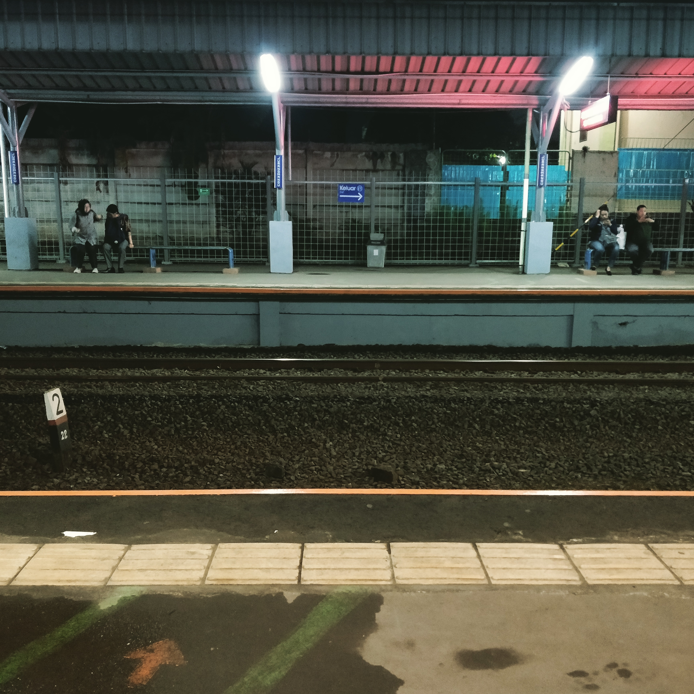

And with this note, I'm signing off for 2018.

What an amazing year it has been. I switched jobs, shipped [a couple](https://docs.kata.ai/) [of stuff](https://aksara.kata.ai/), and met a lot of lovely people especially in the Jakarta dev circles ([JakartaJS](https://www.jakartajs.org/), you rock!).

I have to admit I've been lagging on posts lately, especially approaching the end of the year, partly due to mental health issues. But I'm getting better now, and I'll try to blog more when 2019 comes!

(Also, thoughts and prayers go to [the victims of the tsunami in the Sunda strait](https://www.theguardian.com/world/live/2018/dec/23/indonesia-tsunami-dozens-dead-hundreds-injured-after-anak-krakatoa-erupts).)

