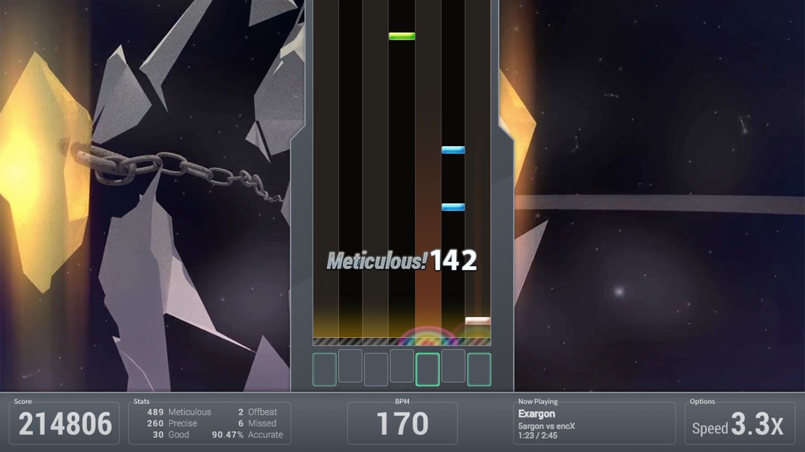

<figure>
  
</figure>

[Bemuse](https://bemuse.ninja/) is a web-based online rhythm action game, developed by [Thai Pangsakulyanont (aka. flicknote)](https://dt.in.th). The basic game mechanics should remind you of O2Jam and Bemani's series of games.

I originally contributed to this project as part of Hacktoberfest 2017, giving the game's frontend UI a much-needed upgrade to React 16. I was then made one of the co-maintainers, and after that I continued contributing to the project ever since.
